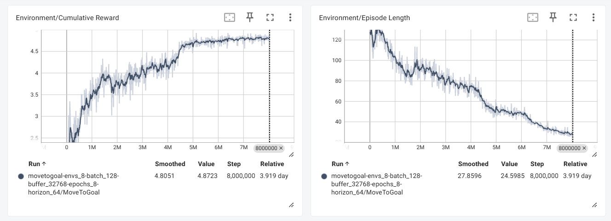
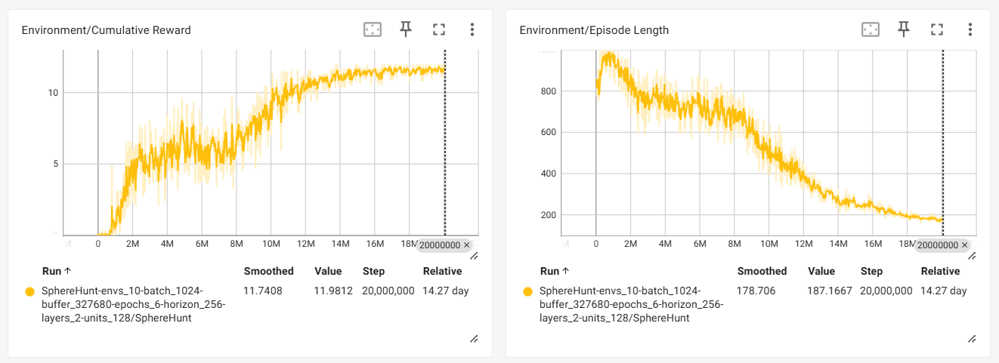

# My RL Projects (3D)

This repository contains a collection of reinforcement learning environments and agents developed for training and testing simple navigation behaviors.

## Projects

### MoveToGoal

In **MoveToGoal**, the agent is tasked with reaching a reward point in the shortest possible time while avoiding any contact with the environment’s borders. The project focuses on optimizing pathfinding behavior under spatial constraints.

**Reward Mechanics**
* Positive Reward:
  * +5: For successfully reaching the target.
* Negative Reward (Penalties):
  * -0.0001: A small penalty applied at each step to encourage faster completion.
  * -0.01: For colliding with a wall (border).

- 📂 [**Go to project folder**](ML-Agents/Examples/MoveToGoal)

  

- 🎥 **Demo:**

  

## Credits

The following assets are used in this project.

- [Simple Gems and Items Ultimate Animated Customizable Pack](https://assetstore.unity.com/packages/3d/props/simple-gems-and-items-ultimate-animated-customizable-pack-73764#publisher) — Available for free use via the Unity Asset Store (NOT included in this repo).

<!-- Add more assets here in the future -->

---

### SphereHunt
In **SphereHunt**, the agent's objective is to first locate a button and then perform a specific _discrete action_ to press it. Once activated, the goal appears, and the agent must then collect it as quickly as possible. This project emphasizes sequential task completion and efficient navigation within a dynamic environment.

**Reward Mechanics**
* Positive Reward:
  * +2: For successfully pressing the button.
  * +10: For collecting the spawned goal.
* Negative Reward (Penalties):
  * -0.0001: A small penalty applied at each step to encourage faster completion.
  * -0.01: For colliding with a wall (border).

- 📂 [**Go to project folder**](ML-Agents/Examples/SphereHunt)

  

- 🎥 **Demo:**

  

