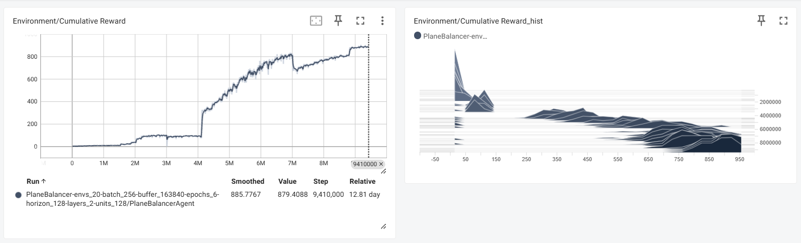
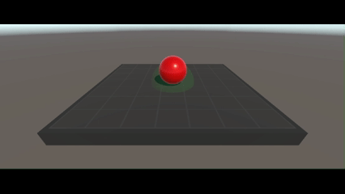

# My RL Projects (3D)

This repository contains a collection of reinforcement learning environments and agents developed for training and testing simple navigation behaviors.

## Projects

### MoveToGoal

In **MoveToGoal**, the agent is tasked with reaching a reward point in the shortest possible time while avoiding any contact with the environment’s borders. The project focuses on optimizing pathfinding behavior under spatial constraints.

**Reward System**
* Positive Reward:
  * +5: For successfully reaching the target.
* Negative Reward (Penalties):
  * -0.0001: A small penalty applied at each step to encourage faster completion.
  * -0.01: For colliding with a wall (border).

- 📂 [**Go to project folder**](ML-Agents/Examples/MoveToGoal)

  

- 🎥 **Demo:**

  

## Credits

The following assets are used in this project.

- [Simple Gems and Items Ultimate Animated Customizable Pack](https://assetstore.unity.com/packages/3d/props/simple-gems-and-items-ultimate-animated-customizable-pack-73764#publisher) — Available for free use via the Unity Asset Store (NOT included in this repo).

<!-- Add more assets here in the future -->

---

### SphereHunt
In **SphereHunt**, the agent's objective is to first locate a button and then perform a specific _discrete action_ to press it. Once activated, the goal appears, and the agent must then collect it as quickly as possible. This project emphasizes sequential task completion and efficient navigation within a dynamic environment.

**Reward System**
* Positive Reward:
  * +2: For successfully pressing the button.
  * +10: For collecting the spawned goal.
* Negative Reward (Penalties):
  * -0.0001: A small penalty applied at each step to encourage faster completion.
  * -0.01: For colliding with a wall (border).

- 📂 [**Go to project folder**](ML-Agents/Examples/SphereHunt)

  

- 🎥 **Demo:**

  

---

### PlaneBalancer 

The **PlaneBalancer** environment consists of a tilting platform and a ball that spawns with varying levels of force ("calm spawn" vs. regular spawn). The agent’s task is to tilt the platform to stabilize the ball and keep it in the designated target area (green area).

**Reward System**

| Event                                   | Curriculum 1 Reward | Curriculum 2 Reward | Notes |
|-----------------------------------------|---------------------|---------------------|-------|
| **Ball still in target area (per sec)** | +0.5                | +0.5                | Granted once per `stillRewardCooldown` (1s) if the ball is motionless inside target. Strong positive shaping signal. |
| **Ball moving in target area (per sec)**| +0.1                | +0.001              | Granted once per cooldown if the ball is inside target but still moving. Encourages stabilization inside the area. |
| **Survival step (each `OnActionReceived`)** | +0.01            | +0.001              | Shaping reward for staying alive; promotes longer episodes. |
| **Ball moving (per `FixedUpdate`)**     | -0.001              | -0.005              | Applied if ball velocity magnitude > threshold. Discourages uncontrolled rolling. |
| **Action penalty (per `ApplyTilt` above threshold)** | -0.001          | -0.005              | Applied if the agent tilts the platform beyond the `tiltPenaltyThreshold`. Discourages twitchiness and unnecessary motion. |
| **Ball falls off platform (once)**      | -1.0                | -1.0                | Strong terminal penalty; ends the episode immediately. |

---

**Curriculum Differences**

- *Curriculum 1*  
  - Provides more forgiving shaping rewards (+0.01 per step, +0.1 for moving inside target).  
  - Motion and action penalties are mild (–0.001 each).  
  - Good for **early exploration** and ensuring the agent understands the basics of survival and reaching the target.  

- *Curriculum 2*  
  - Much stricter: step reward is reduced (+0.001), motion/action penalties are stronger (–0.005 each).  
  - Being inside the target but still moving is barely rewarded (+0.001).  
  - Forces the agent to refine its strategy toward **keeping the ball perfectly still**.  

**Design Notes**

- The **SphereLogic** script enforces reward cooldowns (1s) so that staying in the target area doesn’t flood the agent with excessive rewards.  
- The **PlaneBalancerAgent** uses two main thresholds:  
  - `movementThreshold`: minimum action magnitude before the platform tilts (reduces twitchy micro-motions).  
  - `tiltPenaltyThreshold`: threshold above which tilt actions are penalized.  
- **Calm Spawn**: roughly 10% of the time, the ball spawns with weaker force and spin (marked by turning green). This gives the agent easier starting conditions, aiding curriculum learning.  

**Learning Dynamics**

- *Curriculum 1* encourages basic skills: reaching the target area, surviving, and tolerating some motion.  
- *Curriculum 2* transitions the agent toward **precision control and stability**, heavily punishing twitchiness and ball movement.  
- This setup implements **curriculum learning by reward shaping**, not by environment simplification — the dynamics stay the same, but the signals become stricter over time.

- 📂 [**Go to project folder**](ML-Agents/Examples/planebalancer)

  

- 🎥 **Demo:**

  

